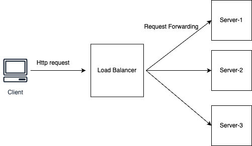
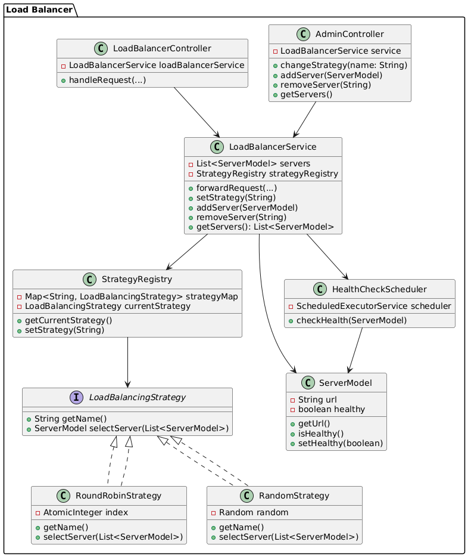

**Liftlab Assignment Loadbalancer**

## Overview
This is a spring-boot based Load Balancer that forwards the incoming HTTP requests to registered backend servers using strateg (Round Robin, Random, etc.). It includes admin endpoints to manage servers and strategies dynamically, and supports basic heath checks for the server before forwarding the request. Scripts are added int repository to start dummy servers and the loadbalancer.

# Technology Used
Java 21, Spring-boot

# High Level Diagram LoadBalancer

# Class diagram of Load Balancer

# How to run the application

Step 1: Clone the project repository.

Step 2: Go to directory bash_scripts

Step 3: start loadbalancer using sh bash_scripts/start_loadbalancer/start-loadbalancer.sh
        - loadbalacer will start on port 8080
Step 4: start dummy servers using sh bash_scripts/dummy-servers/run_dummyServers.sh
        - You will have 3 dummy server running on port 8081, 8082, 8083
# Steps to Test the functionality of loadbalancer

### 1. List server ( /admin/servers )
Use postman or web browser and send get request to http://localhost:8080/admin/servers

### 2. Add server ( /admin/add )
use postman and send post request with server url to http://localhost:8080/admin/add
request body: 
{
"url":"http://localhost:8084"
}

### 3. Remove server ( /admin/remove )
use postman and send delete request with server url to http://localhost:8080/admin/remove  
request body:
{
"url":"http://localhost:8081"
}
### 4. change Strategy  ( /admin/strategy)
use postman and send post request with server url to http://localhost:8080/admin/strategy
request body:
{
"name":"random"
}

